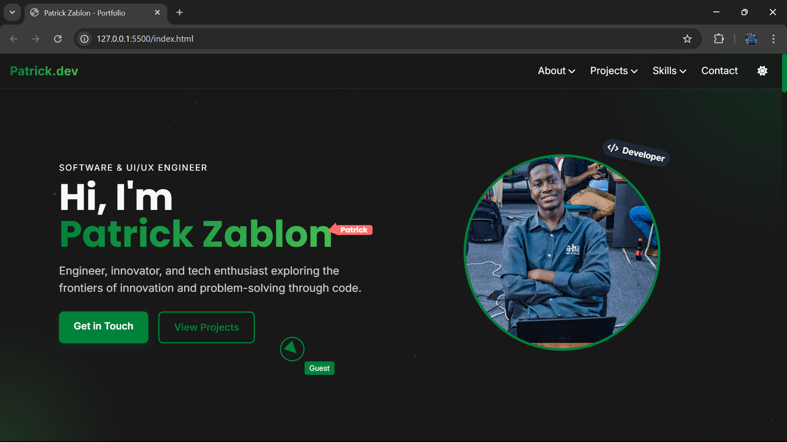

# Patrick Zablon - Portfolio

[](LICENSE)


 <!-- Make sure your image path is correct -->

A modern, interactive portfolio website showcasing my projects, skills, and professional experience. Built with performance and user experience in mind.

## Features

✨ **Key Features:**
- Custom triangular cursor with hover effects
- Interactive 3D particle background using Three.js
- Dark/Light theme toggle with system preference detection
- Responsive design with mobile-first approach
- Smooth scroll animations and transitions
- Project showcases with embedded previews
- Interactive skills matrix with technology icons
- Contact form with Google Maps integration

## Technologies Used

🛠 **Tech Stack:**
- **Frontend:** HTML5, CSS3, JavaScript
- **Styling:** Tailwind CSS
- **Animations:** CSS Transitions/Transforms, Three.js
- **Icons:** Font Awesome
- **Maps:** Google Maps API

## Installation

To run this project locally:

1. Clone the repository:
```bash
git clone https://github.com/iamricky17/portfolio.git
```

2. Navigate to the project directory:
```bash
cd portfolio
```

3. Open in browser:
```bash
# Use Live Server extension or simply open index.html
```

**Note:** For Google Maps functionality:
1. Get a Google Maps API key
2. Add it to the script URL in the contact section:
```html
<script src="https://maps.googleapis.com/maps/api/js?key=YOUR_API_KEY&callback=initMap"></script>
```

## Usage

The portfolio is organized into several sections:

- **Hero Section:** Quick introduction with typing effect
- **About:** Professional summary and contact info
- **Projects:** Interactive project cards with tech tags
- **Skills:** Technology matrix with hover effects
- **Experience:** Timeline of professional journey
- **Contact:** Functional form with location map

## Contributing

Contributions are welcome! Please follow these steps:

1. Fork the project
2. Create your feature branch (`git checkout -b feature/AmazingFeature`)
3. Commit your changes (`git commit -m 'Add some AmazingFeature'`)
4. Push to the branch (`git push origin feature/AmazingFeature`)
5. Open a Pull Request

## License

Distributed under the MIT License. See `LICENSE` for more information.

## Contact

Patrick Zablon - [patrickzablon0@gmail.com](mailto:patrickzablon0@gmail.com)

Project Link: [https://github.com/iamricky17/portfolio](https://github.com/iamricky17/portfolio)

[](https://www.linkedin.com/in/patrick-zablon/)
[](https://github.com/iamricky17)